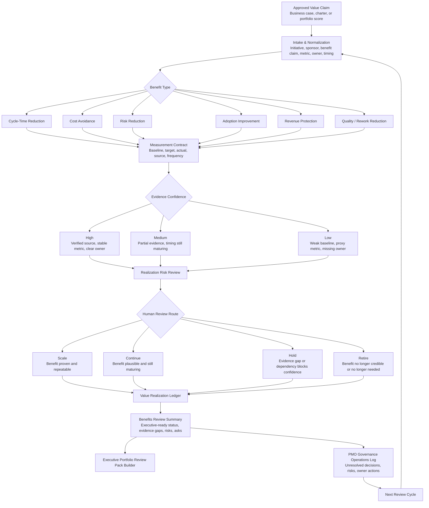

# Value Realization Governance Ledger | PMO Benefits Tracking and Portfolio Value Governance

A lightweight, human-governed benefits governance ledger for connecting approved portfolio value claims to measurable outcomes, evidence confidence, realization risk, and continue / stop / scale review decisions.

## Operating problem

Portfolios often approve work based on promised value, then lose the thread once delivery begins. Business cases, charters, and portfolio scores may contain useful claims, but the operating cadence often shifts toward status, delivery dates, and escalations. Leaders need a simple way to ask: **Did the expected value materialize, what evidence supports that answer, who owns the measure, and what decision is required next?**

This repository provides a public-safe example of an AI-assisted PMO value realization system. It is not a finance system. It is not a PPM platform. It is an operating aid for making benefits traceability visible enough for human review.

## Who this is for

- PMO, EPMO, portfolio, program, and transformation leaders.
- Executives and sponsors reviewing whether approved work is producing measurable value.
- Business operations, technology, finance-partnered, and governance teams that need a practical benefits ledger.
- AI-assisted workflow builders designing ChatGPT Project runtimes for governed executive operations.

## What it does

- Converts approved value claims into a structured benefits ledger.
- Separates value hypotheses from measured outcomes.
- Captures baseline, target, actual, source, frequency, and measure owner fields.
- Classifies benefit types such as cycle-time reduction, cost avoidance, risk reduction, adoption improvement, revenue protection, and quality / rework reduction.
- Reviews evidence confidence and realization risk without manufacturing certainty.
- Produces review-ready benefits status and scale / continue / hold / retire recommendations for human discussion.
- Hands unresolved risks, decisions, and follow-up actions to the PMO Governance Operations Log.
- Hands executive-ready benefits review summaries to the Executive Portfolio Review Pack Builder.

## What it does not do

- It does not calculate official finance results.
- It does not certify savings, cost avoidance, revenue impact, or risk reduction.
- It does not approve, continue, stop, retire, scale, fund, or cancel work.
- It does not replace finance, accounting, audit, compliance, security, legal, HR, or executive owners.
- It does not connect to live financial systems, PPM systems, Jira, ADO, ServiceNow, Smartsheet, email, or calendars.
- It does not create private production records from synthetic examples.

## Module boundary

- **This module starts when** an initiative already has an approved business case, charter, or portfolio score with expected value.
- **This module ends when** a value-realization ledger and benefits review summary are ready for sponsor or executive discussion.
- **This module produces** benefit hypotheses, baseline / target / actual fields, measure-owner records, confidence ratings, realization risks, evidence gaps, and scale / continue / hold / retire recommendations for human review.
- **This module hands off to** PMO Governance Operations Log for unresolved risks, actions, decisions, and owner follow-up; and Executive Portfolio Review Pack Builder for benefits review summaries.
- **This module does not** approve funding, certify value, calculate official financials, replace portfolio scoring, or act as a finance/accounting system.

## Architecture decision

| Decision area | Choice |
|---|---|
| Operating problem | Approved value claims are rarely carried through to measurable benefit review. |
| Existing adjacent modules | Business Case System, Project Charter Initiation Agent, Portfolio Prioritization Scoring Agent, PMO Governance Operations Log, Executive Portfolio Review Pack Builder, Operating Patterns. |
| Missing layer | A lightweight ledger that connects approved intent to outcomes, evidence confidence, benefit owner accountability, and review cadence. |
| Lifecycle position | After approval / scoring / chartering; during and after governed execution; before executive portfolio benefits review. |
| Module owns | Benefits ledger structure, measurement contract, evidence confidence, realization risk, and review-ready benefit status. |
| Adjacent modules own | Business case logic, charter initiation, scoring, active governance log, executive review-pack construction, and reusable operating patterns. |
| Accepted inputs | Approved business cases, charters, portfolio scores, benefit claims, metric definitions, baseline / target / actual data, owner notes, and evidence references. |
| Produced outputs | Value ledger, benefits status summary, evidence-gap list, realization-risk list, measure-owner register, and recommended human review route. |
| Downstream handoffs | Benefits review summary to Executive Portfolio Review Pack Builder; unresolved risks/actions/decisions to PMO Governance Operations Log. |
| Human-owned decisions | Whether value is accepted, disputed, certified, funded, scaled, continued, paused, retired, or escalated. |
| Non-overlap boundary | This module tracks benefits evidence; it does not build business cases, write charters, score portfolio priority, run weekly governance, or assemble the full executive portfolio review pack. |

## Lifecycle position

| Portfolio lifecycle layer | Primary repository | Relationship to this module |
|---|---|---|
| Idea / AI opportunity review | AI Opportunity Intelligence Review System | Upstream only when the initiative started as an AI opportunity. |
| Business case | Business Case System | Provides approved value claims, assumptions, and expected outcomes. |
| Initiation | Project Charter Initiation Agent | Provides scope, sponsor, owner, milestone, and governance context. |
| Prioritization | Portfolio Prioritization Scoring Agent | Provides scored value, urgency, risk, and strategic fit inputs. |
| Execution governance | PMO Governance Operations Log | Receives unresolved benefit risks, actions, and owner follow-up items. |
| Value realization | **Value Realization Governance Ledger** | Owns benefits traceability and realization evidence review. |
| Executive review | Executive Portfolio Review Pack Builder | Receives benefits summaries for sponsor and executive discussion. |

## Workflow



## How to use this in ChatGPT

1. Create a new ChatGPT Project.
2. Upload **only the files inside `chatgpt-project/`**.
3. Do not upload the full repository into ChatGPT. The other folders are for GitHub discovery, examples, workflow source, and package quality review.
4. Start with `start-here.md`.
5. Paste or upload approved value claims from a business case, charter, portfolio scoring record, or benefits review notes.
6. Ask the Project to normalize the claims into a value ledger, screen evidence confidence, identify realization risk, and produce a benefits review summary.

Suggested first prompt:

```text
Use the runtime files to create a value realization governance ledger from the attached approved value claims. Separate benefit hypotheses from measured outcomes, flag evidence gaps, assign confidence ratings, identify realization risks, and produce an executive-ready benefits review summary with scale / continue / hold / retire recommendations for human review.
```

## Full repository use for Codex or local work

Use the full repository when editing, reviewing, or extending the package locally:

1. Open the repository root.
2. Review `README.md`, `AGENTS.md`, `examples/`, `workflow/`, and `quality-review/`.
3. Keep runtime logic inside `chatgpt-project/` flat and self-contained.
4. Keep human-readable example and review files as `.html` unless they are allowed Markdown exceptions.
5. Do not add configuration unless a single `configuration.yml` and an HTML builder form are truly needed. This package intentionally has no configuration file.

No local build step is required. This is a lightweight operating-system package, not an application.

## Folder structure

```text
value-realization-governance-ledger/
  README.md
  AGENTS.md
  LICENSE.md
  .gitignore
  chatgpt-project/
    start-here.md
    operating-model.md
    trigger-map.md
    value-ledger-intake.md
    benefits-taxonomy.md
    measurement-rules.md
    evidence-confidence-screen.md
    realization-risk-screen.md
    review-cadence-rules.md
    output-templates.md
    handoff-rules.md
    working-session-prompts.md
    quality-review-rubric.md
    privacy-human-control.md
  examples/
    sample-data.html
    sample-prompts.html
    sample-output.html
  workflow/
    workflow.mmd
  quality-review/
    package-test-results.html
```

## Runtime file count and constraints

- Runtime folder: `chatgpt-project/`
- Runtime files: **14**
- Runtime folder structure: **flat**
- Runtime cap: **25 files maximum**
- Configuration: **absent by design**
- Live-system dependencies: **none**
- Sample data: **synthetic only**

## Primary outputs

- Value realization ledger.
- Benefit hypothesis register.
- Baseline / target / actual measurement view.
- Measure owner and evidence source register.
- Evidence confidence screen.
- Realization risk screen.
- Evidence gap list.
- Review cadence recommendation.
- Scale / continue / hold / retire recommendation for human review.
- Benefits review summary for executive portfolio review.
- Handoff list for unresolved risks, decisions, and follow-up actions.

## Examples

- `examples/sample-data.html` contains a six-initiative synthetic portfolio scenario.
- `examples/sample-prompts.html` contains copy-ready prompts for running the ChatGPT Project runtime.
- `examples/sample-output.html` demonstrates a benefits ledger and executive review summary.

## Human-control statement

This package assists with intake, classification, analysis, synthesis, routing, drafting, and quality review. Humans remain accountable for official financial results, benefit certification, risk acceptance, funding, continuation, retirement, scaling, stakeholder communication, and executive decisions.

## Search keywords

PMO, EPMO, portfolio governance, value realization, benefits realization, benefits tracking, benefits governance, portfolio value management, executive decision support, business case governance, project charter governance, portfolio scoring, measurement governance, evidence confidence, realization risk, cost avoidance, cycle-time reduction, risk reduction, adoption metrics, revenue protection, human-in-the-loop AI, ChatGPT Project, AI-assisted PMO, portfolio operating model.
